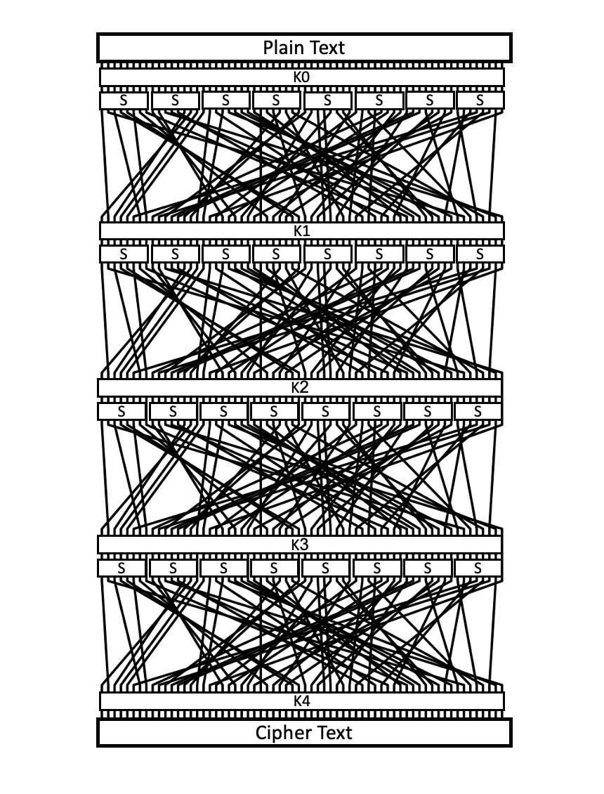

# Soul's Permutation Network

#### Description:
```
wrap the answer with flag{} when you get it

[EU instance](http://161.97.176.150:4004/)

[US instance](http://185.172.165.118:4004/)
```
#### Files:
net.py
```python
import os
import socketserver
import string
import threading
from time import *
import time
import binascii

ROUNDS = 4
BLOCK_SIZE = 8

sbox = [237, 172, 175, 254, 173, 168, 187, 174, 53, 188, 165, 166, 161, 162, 131, 227, 191, 152, 63, 182, 169, 136, 171, 184, 149, 148, 183, 190, 181, 177, 163, 186, 207, 140, 143, 139, 147, 138, 155, 170, 134, 132, 135, 18, 193, 128, 129, 130, 157, 156, 151, 158, 153, 24, 154, 11, 141, 144, 21, 150, 146, 145, 179, 22, 245, 124, 236, 206, 105, 232, 43, 194, 229, 244, 247, 242, 233, 224, 235, 96, 253, 189, 219, 234, 241, 248, 251, 226, 117, 252, 213, 246, 240, 176, 249, 178, 205, 77, 231, 203, 137, 200, 107, 202, 133, 204, 228, 230, 225, 196, 195, 198, 201, 221, 199, 95, 216, 217, 159, 218, 209, 214, 215, 222, 83, 208, 211, 243, 44, 40, 46, 142, 32, 36, 185, 42, 45, 38, 47, 34, 33, 164, 167, 98, 41, 56, 55, 126, 57, 120, 59, 250, 37, 180, 119, 54, 52, 160, 51, 58, 5, 14, 79, 30, 8, 12, 13, 10, 68, 0, 39, 6, 1, 16, 3, 2, 23, 28, 29, 31, 27, 9, 7, 62, 4, 60, 19, 20, 48, 17, 87, 26, 239, 110, 111, 238, 109, 104, 35, 106, 101, 102, 103, 70, 49, 100, 99, 114, 61, 121, 223, 255, 88, 108, 123, 122, 84, 92, 125, 116, 112, 113, 115, 118, 197, 76, 15, 94, 73, 72, 75, 74, 81, 212, 69, 66, 65, 64, 97, 82, 93, 220, 71, 90, 25, 89, 91, 78, 85, 86, 127, 210, 80, 192, 67, 50]
perm = [1, 57, 6, 31, 30, 7, 26, 45, 21, 19, 63, 48, 41, 2, 0, 3, 4, 15, 43, 16, 62, 49, 55, 53, 50, 25, 47, 32, 14, 38, 60, 13, 10, 23, 35, 36, 22, 52, 51, 28, 18, 39, 58, 42, 8, 20, 33, 27, 37, 11, 12, 56, 34, 29, 46, 24, 59, 54, 44, 5, 40, 9, 61, 17]
key = open("flag.txt", "rb").read().strip()

class Service(socketserver.BaseRequestHandler):

    def key_expansion(self, key):
        keys = [None] * 5
        keys[0] = key[0:4] + key[8:12]
        keys[1] = key[4:8] + key[12:16]
        keys[2] = key[0:4] + key[8:12]
        keys[3] = key[4:8] + key[12:16]
        keys[4] = key[0:4] + key[8:12]
        return keys

    def apply_sbox(self, pt):
        ct = b''
        for byte in pt:
            ct += bytes([sbox[byte]])
        return ct

    def apply_perm(self, pt):
        pt = bin(int.from_bytes(pt, 'big'))[2:].zfill(64)
        ct = [None] * 64
        for i, c in enumerate(pt):
            ct[perm[i]] = c
        return bytes([int(''.join(ct[i : i + 8]), 2) for i in range(0, len(ct), 8)])

    def apply_key(self, pt, key):
        ct = b''
        for a, b in zip(pt, key):
            ct += bytes([a ^ b])
        return ct

    def handle(self):
        keys = self.key_expansion(key)
        for i in range(65536):
            pt = os.urandom(8)
            ct = pt
            ct = self.apply_key(ct, keys[0])
            for i in range(ROUNDS):
                ct = self.apply_sbox(ct)
                ct = self.apply_perm(ct)
                ct = self.apply_key(ct, keys[i+1])
            self.send(str((int.from_bytes(pt, 'big'), int.from_bytes(ct, 'big'))))

    def send(self, string, newline=True):
        if type(string) is str:
            string = string.encode("utf-8")

        if newline:
            string = string + b"\n"
        self.request.sendall(string)

    def receive(self, prompt="> "):
        self.send(prompt, newline=False)
        return self.request.recv(4096).strip()


class ThreadedService(
    socketserver.ThreadingMixIn,
    socketserver.TCPServer,
    socketserver.DatagramRequestHandler,
):
    pass


def main():

    port = 4004
    host = "0.0.0.0"

    service = Service
    server = ThreadedService((host, port), service)
    server.allow_reuse_address = True

    server_thread = threading.Thread(target=server.serve_forever)

    server_thread.daemon = True
    server_thread.start()

    print("Server started on " + str(server.server_address) + "!")

    # Now let the main thread just wait...
    while True:
        sleep(10)


if __name__ == "__main__":
    main()
```
#### Auther:
Soul
#### Points and solvers:
At the end of the CTF, 11 teams solved this challenge and it was worth 500 points.

## Solution:
In this writeup I'm **not** going to present the full solution, but I will go into details about how to retrive 1 byte of the key (out of 16 bytes) and it will be very undertandable on how to expand this attack.

### Preperations:
What are we dealing with here? After reading the code you will see that we can get 2 ** 16 plaintext and ciphertext pairs in size of 8 bytes, there are 5 keys inside of the network, each of size 8 bytes as well. 
The network takes a plain text and operates the following steps: `key -> (sbox -> permutation -> key) * 4 times` where the keys alternate between `k0` and `k1`. `Sbox` functions take a single byte and output a single byte, 
they are a non-linear functions and represented by the `sbox` list, byte with value 0 goes to the 0'th place in the array and get the value in this index. `Perm` functions permute bits, they work in a similar way to the sboxes.   
Graph:



Lets clean this code a bit, remove the server stuff, add type annoation and for each function add the reverse of the function including some assertions:
```python
class PermutationNetwork:
    def key_expansion(self, key: bytes) -> List[bytes]:
        keys = [bytes()] * 5
        keys[0] = key[0:4] + key[8:12]
        keys[1] = key[4:8] + key[12:16]
        keys[2] = key[0:4] + key[8:12]
        keys[3] = key[4:8] + key[12:16]
        keys[4] = key[0:4] + key[8:12]
        return keys

    def apply_sbox(self, pt: bytes) -> bytes:
        ct = b''
        for byte in pt:
            ct += bytes([self._single_sbox(byte)])
        assert len(pt) == len(ct)
        return ct

    def _rev_sbox(self, ct: bytes) -> bytes:
        pt = b''
        for byte in ct:
            pt += bytes([self._rev_single_sbox(byte)])
        return pt

    def _single_sbox(self, byte: Union[bytes, int]) -> int:
        if type(byte) == bytes:
            byte = byte[0]
        return sbox[byte]

    def _rev_single_sbox(self, byte: Union[bytes, int]) -> int:
        if type(byte) == bytes:
            byte = byte[0]
        return sbox.index(byte)

    def apply_perm(self, pt: bytes) -> bytes:
        _pt = bin(int.from_bytes(pt, 'big'))[2:].zfill(64)
        ct = [None] * 64
        for i, c in enumerate(_pt):
            ct[perm[i]] = c
        result = bytes([int(''.join(ct[i : i + 8]), 2) for i in range(0, len(ct), 8)])
        assert pt == self._rev_perm(result)
        return result

    def _rev_perm(self, ct: bytes) -> bytes:
        ct = bin(int.from_bytes(ct, 'big'))[2:].zfill(64)
        pt = [None] * 64
        for i, c in enumerate(ct):
            pt[perm.index(i)] = c
        return bytes([int(''.join(pt[i: i + 8]), 2) for i in range(0, len(pt), 8)])

    def apply_key(self, pt, key):
        ct = b''
        for a, b in zip(pt, key):
            ct += bytes([a ^ b])
        return ct

    def enc(self, pt: bytes, rounds: int=ROUNDS):
        keys = self.key_expansion(key)
        ct = pt
        ct = self.apply_key(ct, keys[0])
        for i in range(rounds):
            ct = self.apply_sbox(ct)
            ct = self.apply_perm(ct)
            ct = self.apply_key(ct, keys[i+1])
        return ct
```
Also in order to work with our own data and validate our self let's define the key to be `yellow_submarine` (which is exactly 16 bytes). If you want to work with the original key I kept a result of the [output of the challenge](ptct_pairs.txt) in my git :)

### Research:
After thinking about ways to apply classical attacks like [Meet in the middle attack](https://en.wikipedia.org/wiki/Meet-in-the-middle_attack), [Slide att
ack](https://en.wikipedia.org/wiki/Slide_attack) and [Differential cryptanalysis](https://en.wikipedia.org/wiki/Differential_cryptanalysis) 
(and understanding why each and every one of them is irrelevant to this cipher), I reached the conclusion that the way to go is [Linear cryptanalysis](https://en.wikipedia.org/wiki/Linear_cryptanalysis).

Linear cryptanalysis idea is to look at the xor of some selected bits in the input, and on the xor of some selected bits in the output and ask yourself - are they equal? Let's imagine that the cipher has only one key xor, 
if we select to look at the first bit of the input and the first bit of the output we know that if they are equal than the key is 0 in the first bit and 1 otherwise.   
The group of bits you look at in the input is called a `input mask` and the group of bits in the output is called a `output mask` and we actually ask ourself if the xor of all bits in the input inside the input mask is equal to the xor of all bits in the output inside the output mask 
(instead of saying xor of all of the bits one may say 'pairty' since it is the pairty of number of on bits).

As seen in the example if the cipher was just xor - using linear cryptanalysis we would break it immediately, but as mentioned above, the sbox is non-linear, we can try and find inputs for which the sbox behaves as linear or very close to one, this is where LAT comes into play.    
The Linear approximation table (LAT) has input musks as columns indexes and output masks as rows indexes, the value of a cell is equal to the number of times the pairty was true when running over all the possible inputs minus [the largest input divided by 2].
It is very useful in order to find a input mask and output mask that behaves in a linear fashion, this is a part of the LAT of out sbox:
```
                         input_mask
                                              
               0     1     2     3     4     5     6 

         0     128,  0,    0,    0,    0,    0,    0,  
         1     0,   -90,   8,    14,  -2,   -4,   -2,
output   2     0,    8,    94,  -10,  -2,    6,   -8,  ...
mask     3     0,    14,   2,   -64,  -4,   -6,   -6, 
         4     0,   -6,    0,    6,   -86,  -12,  -2,
         5     0,    8,   -4,    8,    8,    56,  -8, 
                             ...
```
(Notice how when we look at 0 bits of the input and the output - they are always equal and this is why there is 128 in `[0, 0]`)

How to generate LAT:
```python
from tqdm import tqdm  # tqdm is optional but it is very nice in order to predict runtime

SBOX_INPUT_SIZE: int = 256
SBOX_OUTPUT_SIZE: int = 256

def create_lat(pn: PermutationNetwork) -> List[List[int]]:
    lat = [[-SBOX_INPUT_SIZE // 2 for _ in range(SBOX_INPUT_SIZE)] for _ in range(SBOX_OUTPUT_SIZE)]
    for input_mask in tqdm(range(SBOX_INPUT_SIZE)):
        for output_mask in range(SBOX_OUTPUT_SIZE):
            s = 0
            for value in range(SBOX_INPUT_SIZE):
                r = pn._single_sbox(value)
                s += (parity(output_mask & r) == parity(input_mask & value))
            lat[output_mask][input_mask] += s
    return lat
```
Note this code runs over 256 * 256 * 256 values so it takes a few seconds, it is recommended to save the result instead of calculating it again. 

When we have a very large or small number this means that for most of the times the output is equal or that for most of the times it is unequal (in case it is negative). 
This is called a bias, bigger the bias - bigger the probabilty that for a random input the sbox will behave as linear. If we look at the bias for all the input and output masks which are equal and has only one activated bit we get the following results:
```
[-90, 94, -86, -92, 86, -98, 102, -96]
```
These are some very large biases, the correlative probabilities are:
```
[0.1484375, 0.8671875, 0.1640625, 0.140625, 0.8359375, 0.1171875, 0.8984375, 0.125]
```
As long as they are far from 0.5 it is good.

That is all very nice but we have more than one sbox - how can we tell what is the probabilty the cipher itself will act linearly on a given mask? The answer is that it is `0.5 + 2 ** (number of sboxes - 1) * [the multiplication of the fraction biases of each sbox]`. 
So now we just take a input, and look at in under the input and output mask and we can tell the key? It is all depends on the probabilty - given a linear equations of input and output mask with probabilty `0.5 + b` we need `1 / b ** 2` inputs and outputs to show in a significant way that the key that appears for the most times is indeed the correct key (this can be shown using some math - show that normal distribution of random equalities is smaller than the biased normal distribution in a high chance).    
In order to convince yourself about this paragraph - try to remember the example with one key stage - add an sbox that is nearly linear and see that not in all of the cases you get the correct key.


### Find 8 bits of key 
Ok, enough technical background, let's create a linear equation with one input bit and one output bit - for example let's say the input mask is:
```
00000001,00000000,00000000,00000000,00000000,00000000,00000000,00000000
```
Now follow the permutation we can tell that the output bit (and mask) is:
```
00000001,00000000,00000000,00000000,00000000,00000000,00000000,00000000 ->
00000000,00000000,00000000,00000000,00000000,00000100,00000000,00000000 ->
00000000,00000000,00001000,00000000,00000000,00000000,00000000,00000000 ->
00000000,00000000,00000000,00000000,00000000,00000000,00000000,00000010
```
output mask:
```
00000000,00000000,00000000,00000000,00000000,00000000,00000000,00000010
```
The probablity of this to happen is `8 * -0.3515625 * -0.3359375 * -0.359375 * 0.3671875 = -0.12467712163925171` so we need at least `64.33191289696227` plaintexts and ciphertexts pairs to find the correct key from that the linear equation.   
Now we know that if we will pass 64 plaintext and ciphertext we will get that most of the outputs will have the same pairty in at the input with the input mask and at the output with the output mask. This also should apply for the cipher between stages - in one before last stage the bit here:
```
00000000,00000000,00001000,00000000,00000000,00000000,00000000,00000000
```
Should also have the same pairty as the bit in the start, we are going to use that! Let's guess the 8 key bits of the last key that when tracing them back lead to the third byte sbox. We know that under the mask `00001000` in the third byte we need to have the same pairty as with the input. If we guess these key bits correctly and decrypt one stage backwards the ciphertexts in the correct bits positions we should see this pretty clearly. But if we guess the wrong key and decrypt the ciphertexts we will just get random pairty and the linear equation will not be biased as it should.

Take a moment to soke the last paragraph in, it is the most complicated yet once you get this "ha ah moment" linear cryptanalysis and the rest of the 120 bits are in your pocket.

Let's see a bit of code:
```python
# List of pairs plaintext, ciphertext on length greater than 64, in practice I made this 500, just to be on the safe side (we do have 2 ** 16 of those). 
paris = [(pt, ct)]  
# masks of the input and one stage before the last
input_bit, one_before_output_bit = b'\x10\x00\x00\x00\x00\x00\x00\x00', b'\x20\x00\x00\x00\x00\x00\x00\x00'

# Save all the biases
all_results = []
# Guessing 8 bits of key
for key_guess in tqdm(range(SBOX_OUTPUT_SIZE)):
    # Count the bias
    results = Counter()
    for pt, ct in pairs:
        # Decrypt the ciphertext
        unperm_ct = pn._rev_perm(ct)
        un_sbox = list(unperm_ct)
        # From now on we only care about the sbox in location 0
        un_sbox[0] = pn._rev_single_sbox(un_sbox[0] ^ key_guess)
        un_sbox = bytes(un_sbox)
        
        # byte_and perform and operation between two byte arrays, pairty calculates the pairty of the bits
        if parity(byte_and(pt, input_bit)) == parity(byte_and(un_sbox, one_before_output_bit)):
            results.update(['equal'])
        else:
            results.update(['not equal'])
    all_results.append(results)
# Find the largest biases
possible_keys = sorted([(r['equal'], i) for i, r in enumerate(all_results)] +
                       [(r['not equal'], i) for i, r in enumerate(all_results)], reverse=True)
print(possible_keys)
guessed_key = possible_keys[0][1]
```
The variable `guessed_key` contains 8 bits, we can perform `pn.apply_perm(bytes([255] + [0] * 7))` to tell where these bits belone in the final key:
```
01000011,00000000,00000000,00100011,00000000,00000100,00000000,01000000
```
And sure enough when looking at these bits in `key[4]` and looking at `pn.apply_perm(bytes([guessed_key] + [0] * 7))`:
```
01000011,00000000,00000000,00100011,00000000,00000100,00000000,01000000
 |    ||                     |   ||               |             |       
00000001,00000000,00000000,00100001,00000000,00000000,00000000,01000000
00110001,00110101,00110001,00110001,00111001,00111000,01100110,01100100
```
All the bits in the right locations match.   
Do this 7 more times with the correct payloads and you will find the `keys[4]` than decrypt all of the cipher texts one stage and repeat the process.

Thanks for reading so far, there are more simple ways of doing what I describe but in this path I hope you really understood the basics of linear cryptanalysis.

## Flag:
```
flag{151121d998fdb1a9}
```

#### writeup author:
*Yonlif*
